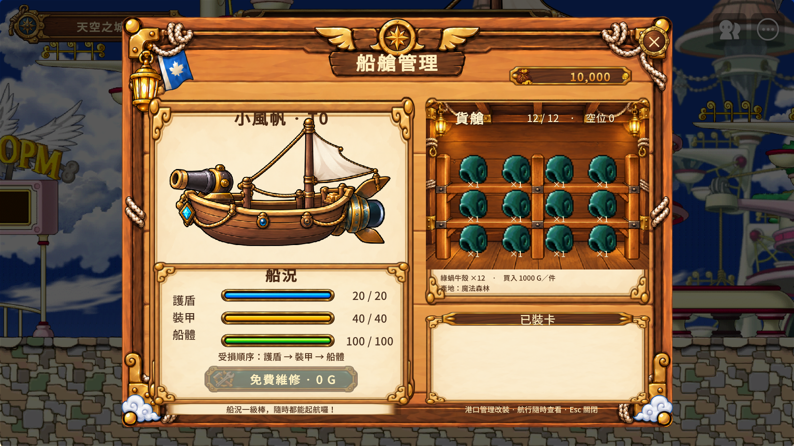

# 存檔 V1、錢袋 UI 與成交回饋驗證

## 2026-10-08 上傳前狀態更新

本輪 Git 保存前新審查：CodeRabbit 完整23檔提出4項有效問題，均已修正；修正複查0 issues。53 tests＋5 subtests、409 body syntax、624交易案例通過。Maker新build時間10:36:29，72 Info／0 Warning／Error，normal39 Info／0 Warning／Error；隔離市場缺省欄位與離場快取清除通過。Abandon卡牌revision本輪Native行為未跑，僅回歸及Native編譯驗證。詳細[審查紀錄](CodeRabbit-Review-20261008.md)。S3凍結來源未改，Rabbit修正是後續delta，不外推S3評論覆蓋。

S3 四席驗收（安全、玩家流程、視覺與獨立仲裁）及正式 Rust 的八筆紀錄驗證已完成，結果為 **limited**：十項已知問題中八項修正、兩項以反證駁回，零項 deferred；八項任務仍維持 Review。凍結快照為 `GV-SAVE-V1-S3`，revision `d47966e67d57fb284e77efe71de81879b074fb8c6fe533068847f8549e51d7c9`。本文下方的 S3 pending 敘述是凍結輸入文件當時狀態；本段與 MissionCenter/closeout.md 更新完成後的狀態，未改寫既有證據。

發布環境 bootstrap gate 預置、獨立 World instance CAS、Native timeout 與實際拔網斷線仍未驗；Git 上傳僅保存 checkpoint，不表示 Maker 已發布本版。原生貨艙、還原船艙與商會畫面已保存為可隨 Git 檢視的圖片：

[還原船艙／維修畫面](images/save-v1/cabin.png) · [商會畫面](images/save-v1/merchant.png)

本機 `MissionCenter/evidence/`、`.builder-work/` 與 `output/` 是隔離診斷及審查紀錄，依 ignore 不上傳；正文的既有本機證據連結不保證能在 GitHub 開啟。對外審查摘要另見 [本輪 CodeRabbit 與上傳紀錄](CodeRabbit-Review-20261008.md)。

2026-10-08。生命週期以 MissionCenter/tasks.md 為準。完成評論使用主人核准的無限總額／每席／工具／時間預算；最終快照 GV-SAVE-V1-S2，獨立 closure 前保留 Review。S3 v7 貨架 Native Play 已完成，獨立 S3 council review 仍 pending，整體維持 Review。

## 最終變更

- 版本化帳號快照保存金錢、貨物數量及成本、所有船的三層船況、使用中船、卡片庫存與三槽，以及四港個人市場／BOSS 庫存。舊市場完整分頁讀入並保留舊鍵。
- ProfileCode 載入／綁定閘門、dirty generation、30 秒背景 Async、單一 writer、既有鍵 CAS 與未知回執讀回；壞檔／未來版本拒絕覆寫，暫時讀取失敗退避重試，timeout 讀回例外不永久卡住 saving。
- 首次建檔需要維護預置全域 GVSaveV1Bootstrap/gate=OPEN。CAS 取得唯一 BUSY token 後重讀帳號，只做一次初始 Set，精確确认才釋放。未知 claim／Set 回執只讀回、不重送；crashed owner 不自動接管。既有帳號不受 bootstrap gate 影響。
- 出航前保存安全快照；抵港／沉船先保存結算。航行重登回出發港，保留已存資產，不重播戰鬥／獎勵；沉船清貨與損毀不因重登復原。連線中取消航程還原時保留最高 ship／economy revision。
- 出航配對請求序號與 targeted Client RPC；成功才關地圖，失敗保留地圖可重試。Native 保留參數 targetUserId 不列入宣告，只在呼叫末尾路由。
- 船艙與商會共同排列「袋 → 金屬數字 → 幣」，千分位、基線一致，裝飾不攔截輸入。袋沿用 `GoldCoinPouch_v2`；S2 歷史使用 coin v2，S3 所有金額（包含 0）使用使用者提供且 byte-identical 的直立 `GoldMapleCoin_v1.png`（SHA-256 `d75219c45cc5a122c3444197b2faa0fb0efccafe9af01ad7837b29ab649e419b`，RUID `eb464db009c04b028b6a97f5bcf68713`），共 14 個 UI 節點，S3 舊 coin v2 引用數量為 0。
- 貨圖保持比例；完整船況列排序為藍護盾／金裝甲／綠船體，數值一起移動；維修板手素材為 `ShipRepairButton_v1.png`（740×128，RUID `e0e20fa76e064bf2b737771e3ec3c4e7`），Simple + AspectOnly 顯示 370×64，文字與 handler 不變。
- Cargo 使用 `HullWall_v1.png` 固定平木牆背景（1448×1086 RGB，SHA-256 `34f1c7dc3474c9bbb96da8deb05cf9b96381936ae03973ac77a128096e7bc24c`，RUID `05ed9097173b49be8dc6b7d012b25c79`）加 `CargoRack_v7.png` 獨立透明木架（1448×1086 RGBA，SHA-256 `0cf91cf6acce60b63f4e6309f6afb7aa7544d621b3be83fa46191d54577b0f18`，RUID `34ee90ba1c3d45b88272eb5dbbbd83fc`，Allowed）。Interior 540×405 at (0,40)，Rack 520×390 at (0,-45)，Simple + AspectOnly；Grid 510×310 at (0,40)。四欄 x=-156/-52/52/156、三列 y=30/-54/-138，cell 72×72；icon 70×52 at (0,10)，label 78×20 at (0,-26)。18 格 UUID 保留；S3 builder 359 entities，原 358 UUID 不變，lint 0 errors／46 既有 warnings。
- Ship authored UI rect 665×835；Future 560×245 at (340,-333)；Merchant Goods authored rect 660×537、runtime 660×584 at (-250,-166)。Cards fullCards 袋 x=-55、size 28×28；幣 x=55、size 20×20；Price rect width 78。Goods 袋／幣 x=-76／76、size 38／28；Price width 112；Inventorysell 不變。
- CargoRack_v7 為三根立柱、兩個寬 bay、恰兩片層板；搭配 HullWall 地板承托三層貨物。Cell 維持 72×72 正方形。
- 成功貨物／卡片买卖幣音；新購船祝賀音、透明金光 burst、大型實船圖與名稱。3.4 秒顯示淡出，連買排隊；失敗、重買、重登不慶祝。

## 本地及 CodeRabbit

指令：C:/Users/USER/miniconda3/python.exe -X utf8 -m pytest Tests/test_save_v1_lua.py Tests/test_transaction_feedback.py -q

結果 **48 passed、5 subtests passed**（34 存檔、14 回饋／出航）前一輪於 08:01 通過；另 14 項 transaction feedback tests 最新 08:11 跑 0.35 秒通過。直接執行 production Lua 方法，涵蓋遷移、dirty 競態、過期回呼、壞檔／容量、退避、timeout 例外、雙 initializer／未知回執、回饋去重、Native RPC 簽名、取消版本單調與缺少 Phase0 的賣卡。

CodeRabbit 隔離快照：初輪 0 issues；第二輪兩項 minor（賣卡 nil／還原 revision）已修。Store major／critical 是讀錯來源，完全相同 SHA、方法定義／呼叫位置、Native 編譯／首次建檔證據駁回。修補後聚焦第三輪 **0 findings、exit0**。保存於 .builder-work/save-v1/coderabbit-review-2.md、coderabbit-store-dispositions.md、coderabbit-review-3.md。主專案未提交／推送；review repo baseline commit 僅供差異審查。

S2 UIBuilder 358 entities、validate 0 findings；lint 0 errors／46 warnings。S3 新增 Rack 後 359 entities，保留原 358 UUID，lint 0 errors／46 既有 warnings。

最後四個 LWA-1106 為本輪數字枚舉賦值警告，已以等價命名枚舉修正；[同版 cleanup](../MissionCenter/evidence/2026-10-08/save-v1/native-enum-cleanup.json)實際 RefreshShop 正面執行、build72 Info／0 Warning／Error、normal188 Info／0 Warning／Error（該 normal bucket 包含前一輪，未以188列為188個新檢查），48項測試及5子案例再通過。CodeRabbit 第三輪0 findings在這四行等價 enum 修正之前；三次每小時審查額度已用完，額外外部重審未執行。低風險四行以官方 enum 定義、原生編譯與實際方法執行確認，最終評論仍獨立檢查。

## Maker 原生證據

[原始完整 QA](../MissionCenter/evidence/2026-10-08/save-v1/native-verification.json)：隔離 GVSaveV1_QA_20261008 成功買兩船、拒絕重買、買二賣一貨物、買二裝一賣一卡，以及出航／離線捕獲／抵港／沉船／冷啟讀回。該輪 build91 Info／normal43 Info、0 Error／Warning。歷史探針錯誤及修正證據保留。

[最終修補 QA](../MissionCenter/evidence/2026-10-08/save-v1/native-final-delta.json)：隔離 GVSaveV1_QA_20261008_Final2 實際 refresh／play／execute_script／logs／stop；最後 build **72 Info／4 Warning／0 Error**、normal **146 Info／0 Warning／Error**。

- Production 初次建立精確 payload、釋放 OPEN、CAS revisions2／3；金額恢復新手12,000。
- 真正 Client→Server→targeted Client：seq1／2 兩次離船拒絕，pending=false、地圖保留可重試；seq3 成功，sailing forest→sky 才關地圖。
- DataStorage GetAndWait 回讀 safePort=forest、revision4、money12,000；production connected Abandon 還原 shipRevision73／economyRevision91，保持單調。
- Native 畫面確認新袋／横躺楓葉幣、商會同步、三層完整列排序、板手、貨艙／比例與放大獲船畫面。
- 最大2,147,483,647全數字在袋與幣之間，使用 client projection fixture，伺服器金額不變。GetPreferredWidth 回報未 auto-fit font28 的348.14大於 rect300；即時最低字體探針仍回舊值，**不列數字 bounds PASS**。實際 best-fit PNG 完整顯示。
- 最終兩貨圖及獲船截图是 client-only 視覺 fixture；production rendering／show-hide 執行，未發船／扣款。真正成功買賣音效回饋在原始 QA。

### S3 UI Native checkpoint

v7 正確 ID `commodity_forest_54` 的 client-only 貨物 fixture 顯示 12/12，三排分別承托於兩層板與地板，沒有重疊且未遮住 footer；測後恢復 production cabin 為 2/8、10,000 金，Maker Stop 後回到 map01/edit。船艙／免費維修截圖為 [085634_940](<C:/Users/USER/AppData/LocalLow/nexon/MapleStory Worlds/McpScreenshots/maker_play_20261008_085634_940.png>)，滿載貨艙為 [085509_379](<C:/Users/USER/AppData/LocalLow/nexon/MapleStory Worlds/McpScreenshots/maker_play_20261008_085509_379.png>)，商會為 [085547_531](<C:/Users/USER/AppData/LocalLow/nexon/MapleStory Worlds/McpScreenshots/maker_play_20261008_085547_531.png>)；初始艙景 [085337_409](<C:/Users/USER/AppData/LocalLow/nexon/MapleStory Worlds/McpScreenshots/maker_play_20261008_085337_409.png>)。錯誤商品 ID `idcommodity_forest_54` 的探針 [085412_564](<C:/Users/USER/AppData/LocalLow/nexon/MapleStory Worlds/McpScreenshots/maker_play_20261008_085412_564.png>) 僅列為 rejected diagnostic，非正面驗收。完整紀錄：[native-ui-s3-v7.json](../MissionCenter/evidence/2026-10-08/save-v1/native-ui-s3-v7.json)。

該次 normal bucket 為 48 Info／0 Warning／0 Error（包含錯誤 ID 診斷）；build bucket 為 72 Info／0 Warning／0 Error，時間 08:06，是既有 script build，不是此次 UI 變更的新 build。港口 T0 production repair cost 0 曾成功；海上 disabled fixture 被 server projection 覆寫，結果 inconclusive。獨立 S3 council review pending。

既有鍵 CAS 證據 .builder-work/save-v1/native-cas-existing-key.json：Global／User各8個 UpdateAsync，均1 code0 winner、7 code2000000，回讀唯一winner。只驗單一 server_main 請求並發，沒有獨立 World instances 宣稱。不存在鍵 Update 不提供 create-if-absent；改用維護預置 gate。Sortable Increase 反例8次都1／最後1，已否決作鎖並保留原始證據。

## 驗證界線與發布前置

離線用 production CaptureProfileForLeave，另實際 Stop／Play 冷啟讀回；未拔網路。抵港 fixture 跳過空戰推進末秒；沉船 fixture hull=0後走 production 結算。音效資源與成功回執 SoundService 呼叫已驗，未人工聆聽。標準 UI 實體滑鼠點按不在覆蓋，使用 production handlers／真正 RPC。

正式發布仍須在所有 instance 停止的維護窗口預置 bootstrap gate；production 不無條件寫 OPEN。不明／crashed BUSY 不直接重設，先排除延遲 claim／profile write。Maker-only default gate 已預置回讀，**不構成發布環境已預置證據**。

Environment/config 既有修改保留。所有 UI 經 builder，codeblock 只由 Maker 生成。最終評論必須明示能力缺口，不能把未觀察的 modality 說成通過。
